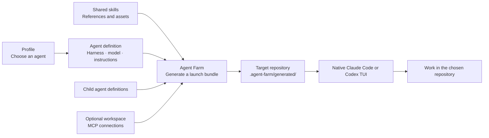

# Agent Farm

**Load the skills and sub-agents you need for each job. Keep the Claude Code or Codex TUI you already use.**

We built Agent Farm to switch between agent setups without installing every skill
and sub-agent into every conversation. A planner needs a different toolkit from
an implementer. An experimental workflow should be easy to try without removing
the one you already use.

Agent Farm lets you choose a named profile at launch. Each profile selects an
agent with a specific harness, model, reasoning level, skills, and sub-agents.
It generates that setup and opens the native Claude Code or Codex terminal in
your chosen repository.

- **Load by task.** Give each agent the skill and sub-agent set its workflow needs.
- **Experiment alongside existing setups.** Create another profile to test new
  skills while keeping your established profile available.
- **Pin model settings.** Define the model and reasoning level in the agent a
  profile selects, including separate settings for its declared children.
- **Keep the native experience.** Use Claude Code or Codex's own TUI, conversation
  controls, and authentication.

```sh
# Choose a skill set, sub-agent configuration, and model together.
agent-farm run astra-planner --directory ~/repos/my-app
agent-farm run implementer --directory ~/repos/my-app
```

Agent Farm adds the selected bundle for each launch. Skills already installed in
native global or project directories can still be visible; Agent Farm does not
hide or remove them. Keep profile-specific skills in Agent Farm's library to
avoid making them globally available.

## Why Agent Farm?

| Approach | Skill and agent setup | Terminal experience |
| --- | --- | --- |
| Native Claude Code / Codex configuration | Manage skills and sub-agents directly in each harness's configuration. | Native Claude Code or Codex TUI. |
| **Agent Farm** | Select a reusable profile with its skills, sub-agents, and pinned model settings for each launch. Keep multiple setups available. | **Native Claude Code or Codex TUI.** |
| [Omnigent](https://omnigent.ai/docs/interact/terminal) | Configure agents through Omnigent's integration layer. | Omnigent's own shared TUI. |

Choose Agent Farm when you want to switch agent configurations while keeping your
native harness interface. Omnigent provides a shared interface across coding-agent
integrations; Agent Farm concentrates on generating configuration and launching
the selected harness. That keeps its scope small: the harness still runs the
conversation and agent turns.

## How it works



- **Profiles** are named entry points that select an agent.
- **Agents** define behavior, model settings, skills, tools, and explicit child bindings.
- **Skills** are reusable Markdown workflows with their own supporting files.
- **Workspaces** supply connections for a project or environment, independently of its folder location.
- **Plugins** package versioned profiles, agents, and skills for installation.

Different profiles can work in the same repository using separate generated
bundles. Repository-owned `AGENTS.md`, `CLAUDE.md`, and references stay in the
repository. Native global configuration can still apply; a bundle is not a sandbox.

## Get started

Requires **Node 22.15+**, **pnpm 11**, macOS or Linux, and the native Claude Code
and/or Codex CLI installed and authenticated. GitHub access to this repository is
required; installation currently uses a source checkout.

```sh
git clone https://github.com/dcouple/agent-farm.git
cd agent-farm
pnpm install --frozen-lockfile
pnpm build
mkdir -p ~/.local/bin
ln -s "$PWD/dist/cli.js" ~/.local/bin/agent-farm
export PATH="$HOME/.local/bin:$PATH"
agent-farm plugin install
```

Add `~/.local/bin` to your shell's persistent `PATH` as well. The symlink points to
this checkout, so keep it in place. `plugin install` installs the bundled `dcouple`
configuration into `~/.config/agent-farm/` and refuses to overwrite modified local
files during updates.

### Launch a conversation

```sh
cd ~/repos/my-app

# See available entry points and their configured models.
agent-farm profiles list

# Open a Codex planner and wait for your first message.
agent-farm run astra-planner

# Open the Claude planner instead.
agent-farm run planner

# Start an implementer with an initial task in another repository.
agent-farm run implementer --directory ~/repos/another-app \
  --message "Investigate the failing tests and propose a fix."
```

The profile's agent controls the harness, model, reasoning level, and speed.
Without `--message`, the native terminal opens for interactive input.
Agent Farm launches Codex with `--yolo` (no approval prompts or sandbox) and
Claude with `--dangerously-skip-permissions`. These defaults also apply to
headless runs and generated process-child launchers.

### Add workspace tools

Define a workspace under `~/.config/agent-farm/workspaces/` with the MCP
connections needed for that project. Workspace names and providers are yours to
choose; see [workspace configuration](CONFIGURATION.md#workspaces-and-repositories).
With a workspace named `my-project` configured:

```sh
# Inspect the resolved agent graph and connection configuration.
agent-farm inspect astra-planner --workspace my-project

# After first-time native OAuth sign-in, launch either identity with the same connections.
agent-farm run astra-planner --workspace my-project
agent-farm run implementer --workspace my-project
```

For a remote OAuth connection named `remote-service`, sign in once per harness:

```sh
agent-farm mcp login remote-service --workspace my-project --harness codex
agent-farm mcp login remote-service --workspace my-project --harness claude
```

Use the actual connection name from your workspace. Workspaces also support local
MCP commands with arguments and environment settings; see the
[connection reference](CONFIGURATION.md#local-mcp-servers-and-native-sign-in).
Authentication uses the native harness or the local service's own credential store. `inspect` shows configuration,
not live connectivity. Omitting `--workspace` adds no workspace connections, but
agent-defined connections and native global tools can still be available.

### Try a different skill system

Point a launch at a local configuration checkout to test changes before publishing:

```sh
agent-farm plugin validate /path/to/skills
agent-farm run astra-planner --config-root /path/to/skills \
  --directory ~/repos/my-app
```

### Load and unload global skills and tools

Use this when you want to open `codex` or `claude` directly, with selected skills
available in every repository. Skill loading and workspace loading are independent:

```sh
# Add the planner's skills to your Codex user configuration.
agent-farm set global astra-planner --harness codex

# Optionally make a configured workspace's MCPs and guidance global too.
agent-farm set global --workspace my-project --harness codex
codex

# The same operations for Claude Code.
agent-farm set global planner --harness claude
agent-farm set global --workspace my-project --harness claude
claude

# Inspect what Agent Farm has installed globally.
agent-farm status global

# Remove either layer independently when you are finished.
agent-farm unset global astra-planner --harness codex
agent-farm unset global --workspace my-project --harness codex
agent-farm unset global planner --harness claude
agent-farm unset global --workspace my-project --harness claude
```

Replace `my-project` with a workspace you have configured. Both loaders accept
`--config-root /path/to/skills` to select another local configuration library.
Complete any initial authentication with `agent-farm mcp login` as described above;
unloading a workspace leaves native credentials intact.

`set global PROFILE` installs **only the entry agent's skills**, not its model, reasoning level,
identity instructions, or sub-agents. Use `run` for the complete agent identity.
Multiple profiles can share global skills; unloading removes only managed links
that no other loaded profile needs.

`set global --workspace NAME` installs MCP connections and the workspace's instructions and
connection descriptions into the native user configuration. Both Claude and Codex
support user-level MCPs. One global workspace can be loaded per harness; unload it
before switching workspaces or applying changed definitions. These tools and
instructions apply across repositories, subject to native configuration precedence.
Existing connections are never adopted or overwritten, and edited managed entries
cause unload to stop and preserve them.

Start a fresh native session after loading or unloading. Existing conversations
can retain context they already read. For Agent Farm launches, keep passing
`run PROFILE --workspace my-project`: Claude launches use strict bundle MCP
configuration, so globally loaded MCPs do not automatically join those launches.
See [global workspace configuration](CONFIGURATION.md#global-workspace-installation)
for file locations and ownership details.

### Save pre-existing global skills

If you already have personal skills installed, inspect their ownership first:

```sh
agent-farm status global

# Save unmanaged Codex skills as a new profile and unmount the originals.
agent-farm unset global --save my-old-skills --harness codex --model gpt-6-astra

# Later, mount those skills globally again, or run them for one repository.
agent-farm set global my-old-skills --harness codex
agent-farm unset global my-old-skills --harness codex
agent-farm run my-old-skills --directory ~/repos/my-app
```

For Claude, use `--harness claude` and the model you want that saved profile to
launch. The model is required because existing skill files do not define one.
This saves skills only; it does not import native model settings, MCPs, agents,
or user instruction files.

Status labels skills **managed**, **unmanaged**, or **changed**. Managed means
Agent Farm has an ownership record and the installed link still matches it.
A link into your library alone does not prove ownership. Changed links are
preserved until you reconcile them with their original installation.

Save-and-unmount copies unmanaged skill folders, including scripts, references,
and other supporting files, into the selected configuration library and creates
an agent and profile. It validates the saved profile before moving the original
folders or links into `~/.local/state/agent-farm/skill-backups/`. It refuses name
collisions. Managed skills remain mounted; use `unset global PROFILE` for those.
The command prints the backup location, including a receipt of original paths.
If unmounting fails, it restores moved originals and retains the saved profile.

Profile launches warn when personal global skills may add context outside the
selected profile, with commands to unmount them. The warning does not block the
launch or change files. It scans the selected harness's native personal skills
folder and, for Codex, `~/.agents/skills`. System skills, plugin skills, Claude's
account-synced skills, legacy Claude command files, and repository skills are
outside this operation; they may still be available in the native session.

`set global` adds a profile's skills without silently replacing other mounted
profiles. Unset the old profile first when switching. The earlier `load`,
`unload`, `loaded`, and `workspace load/unload/loaded` commands remain aliases.

## Configuration layout

Your machine keeps the reusable configuration in one place:

```text
~/.config/agent-farm/
├── profiles/
│   ├── planner.yaml             # Launch entry point: agent: planner
│   ├── astra-planner.yaml
│   └── implementer.yaml
├── agents/
│   ├── planner.md               # Model, skills, children, and instructions
│   ├── astra-planner.md
│   ├── implementer.md
│   └── socrates.md              # A child selected by a parent agent
├── skills/
│   └── create-ticket/
│       ├── SKILL.md             # Name, description, and workflow
│       ├── references/          # Supporting guidance and rubrics
│       └── metadata/
│           └── codex.yaml       # Optional native UI/invocation metadata
├── workspaces/
│   └── my-project.yaml          # Local MCP connections
└── instructions/                # Optional shared instruction includes
```

A profile is a small YAML file:

```yaml
# profiles/my-planner.yaml
agent: my-planner
```

Its agent is Markdown with configuration frontmatter:

```markdown
---
harness: codex
model:
  name: gpt-6-astra
  reasoning: high
description: Clarify requirements and create actionable tickets.
skills:
  - create-ticket
  - explain-visually
subagents:
  socrates:
    agent: astra-socrates
    mode: native
---

Help the user clarify intent and create actionable tickets.
Follow the create-ticket workflow and its Socrates review steps.
Wait for a request when no starter message is supplied.
```

Save it as `agents/my-planner.md`, then run `agent-farm run my-planner`.
This example uses skills and the `astra-socrates` child from the bundled plugin.
Profiles select agents without overriding their behavior. The same agent can be
an entry point, a child, or both. Child bindings explicitly choose native delegation
or a separate process; see the [configuration reference](CONFIGURATION.md).

## Plugins and development

The built-in `dcouple` plugin is authored in
[dcouple/skills](https://github.com/dcouple/skills). That repository's publish
command validates the configuration and opens a PR updating the versioned snapshot
in `plugins/dcouple/`. Edit the source configuration there; keep workspace
connections and credentials local.

Plugins currently distribute configuration files, skills, and supporting resources.
They do not execute middleware hooks. CLI releases and plugin versions are separate.
After updating Agent Farm, run `agent-farm plugin install` to apply bundled content
updates; local modifications produce conflicts rather than being overwritten.

For launcher development:

```sh
pnpm typecheck
pnpm test
```

## Documentation and current scope

- [Configuration reference](CONFIGURATION.md): file formats, skill metadata, generated layouts, workspace connections, and child agents.
- [Operational notes and limitations](docs/operations.md): authentication, generated files, current boundaries, and plugin rollout.
- [Verification history](docs/verification-history.md): component tests, native-session checks, and what remains unverified.
- [Example configurations](examples/): small local configuration examples.
- [Skill and profile sources](https://github.com/dcouple/skills): authoring and publishing the `dcouple` plugin.

The current release supports native Claude/Codex launch, configuration bundles,
workspace MCPs, declared children, and managed user-level skills and workspaces. Subscription
rotation, integrated tracing, and daemon orchestration remain future work.
