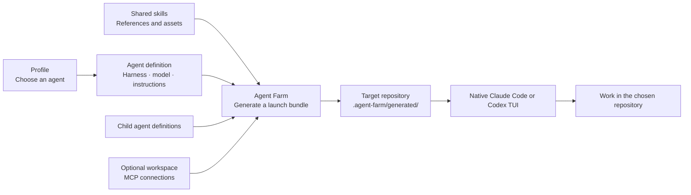

# Agent Farm

**Load the skills and sub-agents you need for each job. Keep the Claude Code or Codex TUI you already use.**

We built Agent Farm to switch between agent setups without installing every skill
and sub-agent into every conversation. A planner needs a different toolkit from
an implementer. An experimental workflow should be easy to try without removing
the one you already use.

Agent Farm lets you choose a named profile at launch. Each profile selects an
agent with a specific harness, model, reasoning level, skills, and sub-agents.
It generates that setup and opens the native Claude Code or Codex terminal in
your chosen repository.

- **Load by task.** Give each agent the skill and sub-agent set its workflow needs.
- **Experiment alongside existing setups.** Create another profile to test new
  skills while keeping your established profile available.
- **Pin model settings.** Define the model and reasoning level in the agent a
  profile selects, including separate settings for its declared children.
- **Keep the native experience.** Use Claude Code or Codex's own TUI, conversation
  controls, and authentication.

```sh
# Choose a skill set, sub-agent configuration, and model together.
agent-farm run astra-planner --directory ~/repos/my-app
agent-farm run implementer --directory ~/repos/my-app
```

Agent Farm adds the selected bundle for each launch. Skills already installed in
native global or project directories can still be visible; Agent Farm does not
hide or remove them. Keep profile-specific skills in Agent Farm's library to
avoid making them globally available.

## Why Agent Farm?

| Approach | Skill and agent setup | Terminal experience |
| --- | --- | --- |
| Native Claude Code / Codex configuration | Manage skills and sub-agents directly in each harness's configuration. | Native Claude Code or Codex TUI. |
| **Agent Farm** | Select a reusable profile with its skills, sub-agents, and pinned model settings for each launch. Keep multiple setups available. | **Native Claude Code or Codex TUI.** |
| [Omnigent](https://omnigent.ai/docs/interact/terminal) | Configure agents through Omnigent's integration layer. | Omnigent's own shared TUI. |

Choose Agent Farm when you want to switch agent configurations while keeping your
native harness interface. Omnigent provides a shared interface across coding-agent
integrations; Agent Farm concentrates on generating configuration and launching
the selected harness. That keeps its scope small: the harness still runs the
conversation and agent turns.

## How it works



- **Profiles** are named entry points that select an agent.
- **Agents** define behavior, model settings, skills, tools, and explicit child bindings.
- **Skills** are reusable Markdown workflows with their own supporting files.
- **Workspaces** supply connections for a project or environment, independently of its folder location.
- **Plugins** package versioned profiles, agents, and skills for installation.

Different profiles can work in the same repository using separate generated
bundles. Repository-owned `AGENTS.md`, `CLAUDE.md`, and references stay in the
repository. Native global configuration can still apply; a bundle is not a sandbox.

## Get started

Requires **Node 22.15+**, **pnpm 11**, macOS or Linux, and the native Claude Code
and/or Codex CLI installed and authenticated. GitHub access to this repository is
required; installation currently uses a source checkout.

```sh
git clone https://github.com/dcouple/agent-farm.git
cd agent-farm
pnpm install --frozen-lockfile
pnpm build
mkdir -p ~/.local/bin
ln -s "$PWD/dist/cli.js" ~/.local/bin/agent-farm
export PATH="$HOME/.local/bin:$PATH"
agent-farm plugin install
```

Add `~/.local/bin` to your shell's persistent `PATH` as well. The symlink points to
this checkout, so keep it in place. `plugin install` installs the bundled `dcouple`
configuration into `~/.config/agent-farm/` and refuses to overwrite modified local
files during updates.

### Launch a conversation

```sh
cd ~/repos/my-app

# See available entry points and their configured models.
agent-farm profiles list

# Open a Codex planner and wait for your first message.
agent-farm run astra-planner

# Open the Claude planner instead.
agent-farm run planner

# Start an implementer with an initial task in another repository.
agent-farm run implementer --directory ~/repos/another-app \
  --message "Investigate the failing tests and propose a fix."
```

The profile's agent controls the harness, model, reasoning level, and speed.
Without `--message`, the native terminal opens for interactive input.

### Add workspace tools

Define a workspace under `~/.config/agent-farm/workspaces/` with the MCP
connections needed for that project. Workspace names and providers are yours to
choose; see [workspace configuration](CONFIGURATION.md#workspaces-and-repositories).
With a workspace named `my-project` configured:

```sh
# Inspect the resolved agent graph and connection configuration.
agent-farm inspect astra-planner --workspace my-project

# Launch either identity with the same workspace connections.
agent-farm run astra-planner --workspace my-project
agent-farm run implementer --workspace my-project
```

Authentication uses the native harness; credentials stay in its credential stores. `inspect` shows configuration,
not live connectivity. Omitting `--workspace` adds no workspace connections, but
agent-defined connections and native global tools can still be available.

### Try a different skill system

Point a launch at a local configuration checkout to test changes before publishing:

```sh
agent-farm plugin validate /path/to/skills
agent-farm run astra-planner --config-root /path/to/skills \
  --directory ~/repos/my-app
```

You can also load a profile's skills into the native user-level skill directories:

```sh
agent-farm load astra-planner
agent-farm loaded
agent-farm unload astra-planner
```

`load` installs only the entry agent's skills. `run` launches its complete
configuration, including model, children, and connections. Unloading removes
managed skill links; existing conversations can retain already-loaded context.

## Configuration layout

Your machine keeps the reusable configuration in one place:

```text
~/.config/agent-farm/
├── profiles/
│   ├── planner.yaml             # Launch entry point: agent: planner
│   ├── astra-planner.yaml
│   └── implementer.yaml
├── agents/
│   ├── planner.md               # Model, skills, children, and instructions
│   ├── astra-planner.md
│   ├── implementer.md
│   └── socrates.md              # A child selected by a parent agent
├── skills/
│   └── create-ticket/
│       ├── SKILL.md             # Name, description, and workflow
│       ├── references/          # Supporting guidance and rubrics
│       └── metadata/
│           └── codex.yaml       # Optional native UI/invocation metadata
├── workspaces/
│   └── my-project.yaml          # Local MCP connections
└── instructions/                # Optional shared instruction includes
```

A profile is a small YAML file:

```yaml
# profiles/my-planner.yaml
agent: my-planner
```

Its agent is Markdown with configuration frontmatter:

```markdown
---
harness: codex
model:
  name: gpt-6-astra
  reasoning: high
description: Clarify requirements and create actionable tickets.
skills:
  - create-ticket
  - explain-visually
subagents:
  socrates:
    agent: astra-socrates
    mode: native
---

Help the user clarify intent and create actionable tickets.
Follow the create-ticket workflow and its Socrates review steps.
Wait for a request when no starter message is supplied.
```

Save it as `agents/my-planner.md`, then run `agent-farm run my-planner`.
This example uses skills and the `astra-socrates` child from the bundled plugin.
Profiles select agents without overriding their behavior. The same agent can be
an entry point, a child, or both. Child bindings explicitly choose native delegation
or a separate process; see the [configuration reference](CONFIGURATION.md).

## Plugins and development

The built-in `dcouple` plugin is authored in
[dcouple/skills](https://github.com/dcouple/skills). That repository's publish
command validates the configuration and opens a PR updating the versioned snapshot
in `plugins/dcouple/`. Edit the source configuration there; keep workspace
connections and credentials local.

Plugins currently distribute configuration files, skills, and supporting resources.
They do not execute middleware hooks. CLI releases and plugin versions are separate.
After updating Agent Farm, run `agent-farm plugin install` to apply bundled content
updates; local modifications produce conflicts rather than being overwritten.

For launcher development:

```sh
pnpm typecheck
pnpm test
```

## Documentation and current scope

- [Configuration reference](CONFIGURATION.md): file formats, skill metadata, generated layouts, workspace connections, and child agents.
- [Operational notes and limitations](docs/operations.md): authentication, generated files, current boundaries, and plugin rollout.
- [Verification history](docs/verification-history.md): component tests, native-session checks, and what remains unverified.
- [Example configurations](examples/): small local configuration examples.
- [Skill and profile sources](https://github.com/dcouple/skills): authoring and publishing the `dcouple` plugin.

The current release supports native Claude/Codex launch, configuration bundles,
workspace MCPs, declared children, and managed user-level skills. Subscription
rotation, integrated tracing, and daemon orchestration remain future work.
