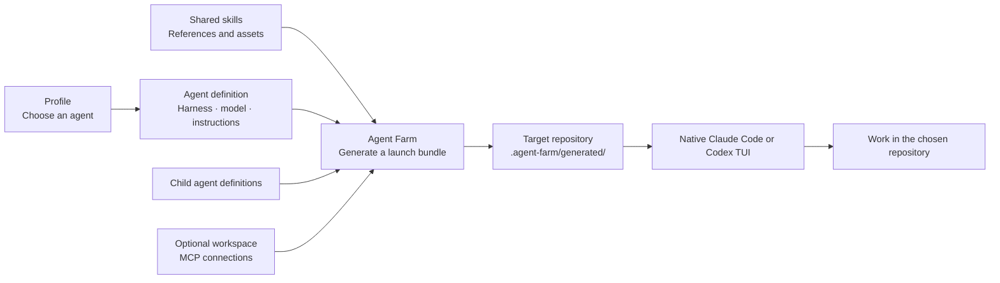

# Agent Farm

**Switch between agent skill sets and models without reconfiguring Claude Code or Codex.**

Pick a profile, and Agent Farm assembles the right skills, sub-agents, and model settings into one launch — straight into the native terminal you already use.

```sh
agent-farm run planner --directory ~/repos/my-app
agent-farm run implementer --directory ~/repos/my-app
```

## Why use it

- **One command, full setup.** Each profile bundles a harness, model, reasoning level, skills, and sub-agents.
- **Side-by-side experiments.** Try a new skill set without touching your current one.
- **Native terminal.** Claude Code and Codex run their own TUI — Agent Farm just configures and launches.

## How it works



**Profiles** select an agent. **Agents** define behavior, model, skills, and child bindings. **Skills** are reusable Markdown workflows. **Workspaces** supply MCP connections for a project. **Plugins** package profiles, agents, and skills for distribution.

Multiple profiles can target the same repository with separate bundles. Your repo's `AGENTS.md`, `CLAUDE.md`, and native global config still apply.

## Install

Requires **Node 22.15+**, **pnpm 11**, macOS or Linux, and the Claude Code or Codex CLI installed and authenticated.

```sh
git clone https://github.com/dcouple/agent-farm.git
cd agent-farm
pnpm install --frozen-lockfile
pnpm build
mkdir -p ~/.local/bin
ln -s "$PWD/dist/cli.js" ~/.local/bin/agent-farm
export PATH="$HOME/.local/bin:$PATH"
agent-farm plugin install
```

Add `~/.local/bin` to your shell's persistent `PATH`. The symlink points to this checkout, so keep it in place.

## Launch

```sh
# List available profiles and their models.
agent-farm profiles list

# Open a Codex planner interactively.
agent-farm run astra-planner

# Start an implementer with a task.
agent-farm run implementer --directory ~/repos/another-app \
  --message "Investigate the failing tests and propose a fix."
```

Without `--message`, the native terminal opens for interactive input. See [launch permissions](docs/operations.md#launch-permissions) for default flags.

## Workspaces

Add MCP connections to any launch by defining a workspace under `~/.config/agent-farm/workspaces/`:

```sh
agent-farm run astra-planner --workspace my-project
agent-farm inspect astra-planner --workspace my-project
```

For remote OAuth connections, sign in once per harness:

```sh
agent-farm mcp login remote-service --workspace my-project --harness codex
```

See the [workspace and connection reference](CONFIGURATION.md#workspaces-and-repositories) for YAML format, local MCP servers, and connection descriptions.

## Global skills

Load a profile's skills into your native harness so they're available when you open `claude` or `codex` directly:

```sh
agent-farm set global planner --harness claude
agent-farm status global
agent-farm unset global planner --harness claude
```

This installs the profile's skills only — not its model, instructions, or sub-agents. Use `run` for the complete agent identity. See [global workspace installation](CONFIGURATION.md#global-workspace-installation) for loading workspace MCPs globally.

## Configuration

All reusable configuration lives in `~/.config/agent-farm/`:

```text
~/.config/agent-farm/
├── profiles/        # YAML entry points (agent: <name>)
├── agents/          # Markdown with model/skills/children frontmatter
├── skills/          # Reusable workflows with references and metadata
├── workspaces/      # MCP connection definitions
└── instructions/    # Optional shared instruction includes
```

A profile is a one-line YAML file pointing to an agent. An agent is Markdown with configuration frontmatter:

```markdown
---
harness: codex
model:
  name: gpt-6-astra
  reasoning: high
skills:
  - create-ticket
  - explain-visually
subagents:
  socrates:
    agent: astra-socrates
    mode: native
---

Help the user clarify intent and create actionable tickets.
```

Save it as `agents/my-planner.md`, create a profile, and run `agent-farm run my-planner`. Full format details are in the [configuration reference](CONFIGURATION.md).

## Test a local skill set

Point a launch at a local checkout to try changes before publishing:

```sh
agent-farm plugin validate /path/to/skills
agent-farm run astra-planner --config-root /path/to/skills
```

## Plugins

The bundled `dcouple` plugin ships profiles, agents, and skills authored in [dcouple/skills](https://github.com/dcouple/skills). Run `agent-farm plugin install` after updating the CLI to apply new content.

## Development

```sh
pnpm typecheck
pnpm test
```

## Documentation

- [Configuration reference](CONFIGURATION.md) — file formats, skill metadata, workspaces, child agents
- [Operational notes](docs/operations.md) — authentication, generated files, launch permissions, boundaries
- [Verification history](docs/verification-history.md) — tests and what remains unverified
- [Example configurations](examples/) — small working examples
- [Skill and profile sources](https://github.com/dcouple/skills) — the `dcouple` plugin source
