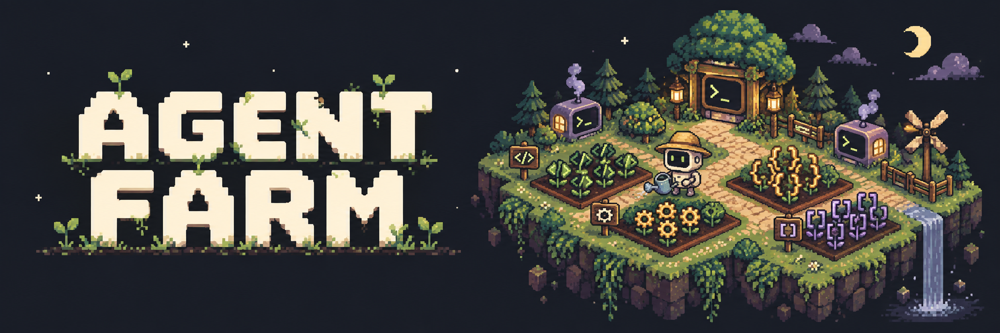
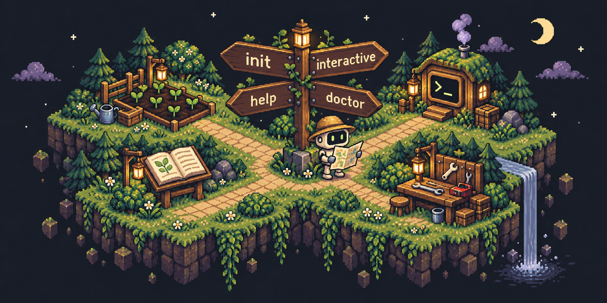
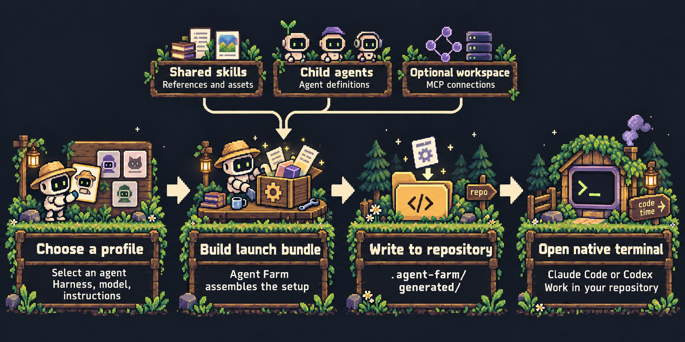
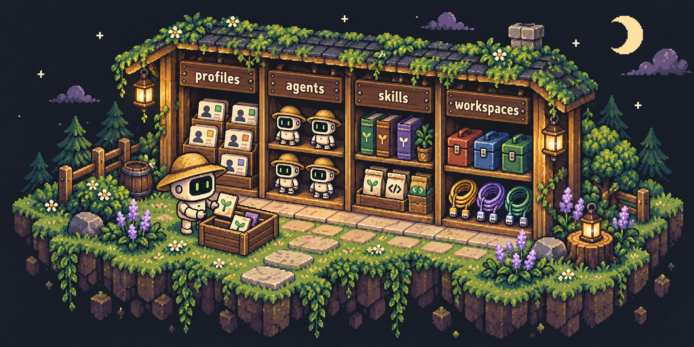

# Agent Farm

**Load the right skills for each job. Keep your native terminal.**

Agent Farm is a harness configurator. A harness is the full working setup around
an AI model — instructions, tools, permissions, and checks. Agent Farm lets you
save different setups and switch between them without reinstalling everything
for every conversation.

Pick a setup, point it at a repo, and Agent Farm opens your native Claude Code
or Codex terminal with that configuration loaded.

Think of each setup as a desk prepared for a job. For SEO, you might lay out site
references, search tools, and a skill that walks through researching and improving
a page. For presentations, you bring brand guidelines, slide tools, and a workflow
for turning an outline into a story. Each setup keeps the relevant material close
to the work.

## Install

Requires **Node 22.15+**, macOS or Linux, and the Claude Code and/or Codex CLI
installed and authenticated.

```sh
git clone https://github.com/dcouple/agent-farm.git
cd agent-farm
pnpm install --frozen-lockfile && pnpm build
mkdir -p ~/.local/bin
ln -s "$PWD/dist/cli.js" ~/.local/bin/agent-farm
```

Add `~/.local/bin` to your shell's `PATH`, then:

```sh
agent-farm init
```

After pulling updates, run `agent-farm plugin install` to sync new profiles.

It checks your prerequisites, installs the default profiles and skills, explains
how everything fits together, and offers to launch your first session.

## Profiles

Agent Farm ships with profiles ready to use. The interactive launcher shows
them like this:

```
◆  What would you like to do?
│  ● claude-pr-reviewer     claude · claude-opus-4-6 · high
│  ○ codex-pr-reviewer      codex · gpt-5.5 · medium
│  ○ claude-worker           claude · claude-fable-5-1 · high
│  ○ codex-worker            codex · gpt-6-astra · medium
│  ─────────────────────
│  + Create new profile
│  ✎ Edit a profile
│  ⊕ Inspect a profile
```

**Reviewers** — `claude-pr-reviewer` and `codex-pr-reviewer` spawn 13
parallel sub-agents to review a PR across independent principles (reuse,
scope, security, spec fidelity, and more). Each sub-agent discovers the
project's conventions first. Can optionally plan and apply fixes.

**Workers** — `claude-worker` (Fable 5.1) and `codex-worker` (Astra) take
a ticket from discussion through planning and implementation to a prepared
PR. Each leans into its harness's strengths — Codex uses native sub-agents
for implementation and QA, Claude uses a streamlined discussion → plan →
implement → PR pipeline.

Run `agent-farm profiles list` to see all installed profiles.

## Four entry points



```sh
agent-farm init         # First-time setup — the starting point
agent-farm              # Interactive — pick a profile, create one, launch
agent-farm help         # Reference — every command, for humans and agents
agent-farm doctor       # Diagnostic — check prerequisites, config, profiles
```

`agent-farm init` is where you start. After that, `agent-farm` is your
everyday launcher. `agent-farm help` is the single discovery point for all
commands. `agent-farm doctor` tells you what's working and what's not.

### For power users

```sh
agent-farm run planner
agent-farm run implementer --workspace my-project --message "Fix the failing tests"
```

Run `agent-farm help run` for all flags.

## How it works



Choose a profile to select an agent's harness, model, and instructions. Agent Farm
combines that definition with shared skills, child agent definitions, and optional
workspace MCP connections into a launch bundle in `.agent-farm/generated/` in the
target repository, then opens Claude Code or Codex to work there.

- **Profile** — a saved setup. "When I say *planner*, I mean: use this AI, with these skills, at this thinking level." Like choosing which worker to send.
- **Agent** — the worker definition. Which AI brain, what it knows, what instructions it follows, who it can delegate to.
- **Skill** — a playbook. Step-by-step instructions for a kind of task: how to create a ticket, review code, or investigate a bug.
- **Workspace** — the toolbox for a project. Which external tools (Linear, Sentry, databases) an agent can reach when working on that project.

## Configuration



All config lives in `~/.config/agent-farm/`. The interactive CLI creates
profiles and workspaces for you. To edit by hand:

```text
~/.config/agent-farm/
├── profiles/        # planner.yaml → agent: planner
├── agents/          # planner.md → harness, model, skills, instructions
├── skills/          # Reusable skill directories with SKILL.md
└── workspaces/      # MCP connections per project
```

See the [configuration reference](CONFIGURATION.md) for file formats, child
agents, skill metadata, and workspace connections.

## Documentation

- [Configuration reference](CONFIGURATION.md)
- [Operational notes](docs/operations.md)
- [Verification history](docs/verification-history.md)
- [Example configurations](examples/)
- [Skill and profile sources](https://github.com/dcouple/skills)
