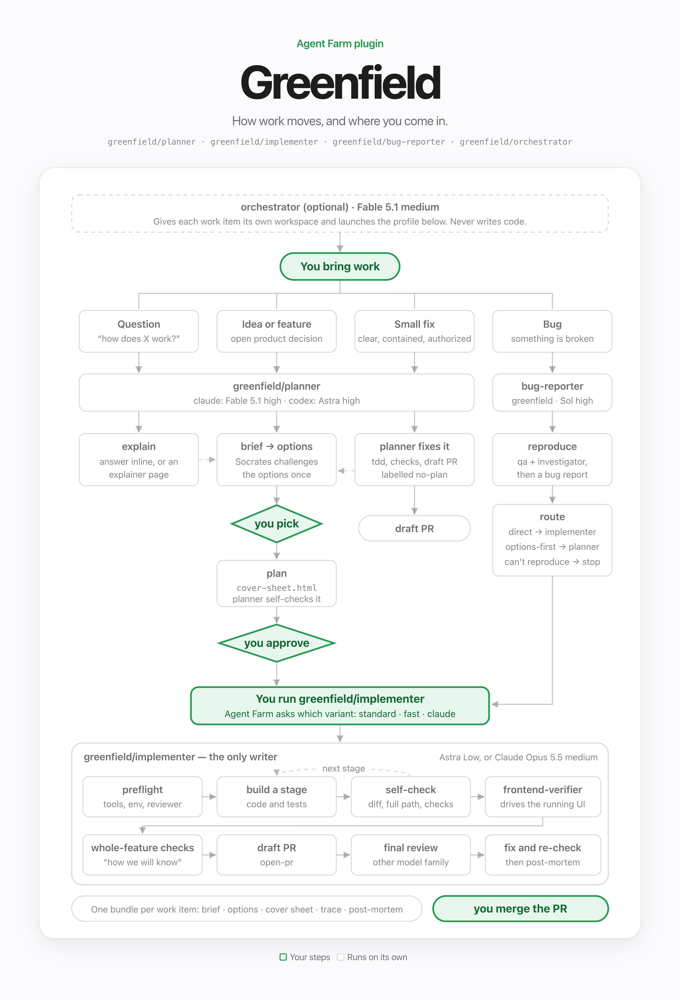

# greenfield

Plan with a high-level cover sheet, then let one implementer build the feature and check its work at every package stage. You pick the implementer's model when you launch it: Astra Low by default, or Claude Opus 5.5. A focused frontend verifier exercises the running UI during implementation. A reviewer on the other model family reviews the finished change; the same implementer makes all corrections.

`greenfield` is self-contained and can be installed alongside `dcouple` and `orchestra`. This version changes the default implementer from Sol with economy workers to Astra Low without implementation delegation. Existing detailed plans remain accepted, but new plans do not require markdown implementation plans or handoff cards.

For a one-page visual map of how work is routed, open [index.html](index.html). It's also on Grain: [view the guide](https://rungrain.com/share/49gtyr7fi7hm75n71itmmlgl).



## Profiles

| Profile | Entry model | Role |
| --- | --- | --- |
| `planner` (`planner:claude`) | Fable 5.1 high | Discussion, brief/options when needed, then the approved cover sheet |
| `planner:codex` | Astra high | The same planner workflow on Codex |
| `implementer` (`implementer:standard`) | Astra low | All implementation and corrections, package self-checks, frontend verification, final review, draft PR |
| `implementer:fast` | Astra low, fast service tier | Compatibility variant of the same implementer; sets `priority: speed`, never adds workers |
| `implementer:claude` | Claude Opus 5.5 medium | The same implementer workflow on Claude, reviewed by Astra |
| `bug-reporter` | Sol high | Reproduce and write a report without fixing code |
| `free-range` / `free-range:claude` | Astra medium / Fable 5.1 high | Raw-model comparison profiles without the Greenfield workflow |
| `orchestrator` | Fable 5.1 medium | Experimental coordination of separate work items/worktrees |

```sh
agent-farm plugin install greenfield
agent-farm run greenfield/planner --directory /path/to/project
agent-farm run greenfield/implementer --directory /path/to/project/worktrees/feature \
  --arg source=/absolute/path/to/bundle/cover-sheet.html
```

The implementer explicitly selects the standard service tier by default, overriding any inherited fast setting. Opt in to fast mode with `--speed fast` (reasoning remains Low):

```sh
agent-farm run greenfield/implementer --speed fast --directory /path/to/project \
  --arg source=/absolute/path/to/bundle/cover-sheet.html
```

The source can also be a published artifact link, legacy plan, direct bug report, or contained task. The implementer reads the actual cover sheet and its linked approved design. It does not require a second planning document.

For local development without installing:

```sh
agent-farm plugin validate plugins/greenfield
agent-farm run implementer --config-root /path/to/agent-farm/plugins/greenfield \
  --directory /path/to/project --arg source=/absolute/path/to/bundle/cover-sheet.html
```

Use a CLI that supports profile variants. If an older installed CLI reports `Unsupported prototype fields: variants, default`, keep its existing plugin installation and use this repository's built CLI until the CLI is updated:

```sh
pnpm build
node dist/cli.js run implementer --config-root plugins/greenfield \
  --directory /path/to/project --arg source=/absolute/path/to/bundle/cover-sheet.html
```

## Options and complexity

Options include a short complexity statement covering added codebase complexity, likely bug risks, ongoing maintenance, and the feature requirements driving that cost. Present meaningful simplifications or deferrals with the user value lost, alongside implementation alternatives. Ground claims in known systems and label assumptions; do not invent numerical scores. Carry the chosen trade-off into the plan.

## Planning and the finish line

The planner retains the HTML `cover-sheet.html` in the existing work bundle. It contains the outcome, scope and exclusions, locked decisions, high-level architecture context, approved design, meaningful risks, and concise package approach notes: how the work will be implemented, systems reused or extended, new systems and why, schema/data changes or none, dependencies, and relevant checks. Use stacked package cards with visible outcomes and important risks, meaningful reuse/extend/new labels, and expandable approach notes on the same page. The narrative layout follows the approved Agent-started Grain setup sample. The implementer chooses concrete files, algorithms, and steps using repository patterns.

Every brief and plan cover sheet includes a linked table of contents and references to its other bundle files. Constraints and Non-goals occupy separate full-width sections stacked vertically, including on wide screens.

Keep the existing **How we will know it works** presentation: numbered journeys and whole-feature commands/suites, with observable outcomes and relevant prerequisites. No separate validation matrix or mandatory criterion IDs are needed. All requested behavior and approved visual states must be covered, including alternate entry paths when relevant. The planner records verification prerequisites and known blockers; it does not build a new harness as part of routine planning. The planner self-checks scope, approach, verification and presentation before marking the cover sheet ready for approval. Socrates remains earlier in options, before the direction is chosen; there is no separate plan-reviewer agent.

The cover sheet is the only plan document; older plans are still accepted as input. Planning is ready when the product decisions are settled and the finish line is testable, with coding choices left to the implementer.

## Implementation and checks

There is one implementation writer. The implementer, Astra Low or Claude Opus 5.5 depending on the variant, builds every package and every correction itself, including tests. It cannot delegate implementation to a worker, another implementer, or a shell-launched coding agent. The implementer binding exposes no worker or advisor child.

At each package boundary it inspects the diff, follows the full caller/data path, runs focused checks, and records validation results. Routine in-scope adapter/file changes do not bounce to the planner. Behavior changes use the `tdd` skill; existing repository checks still apply.

The frontend verifier can run as soon as a UI stage is usable. Dispatch only the relevant criteria, exact routes/navigation hints, fixture/session, expected results, design reference, current revision, and evidence directory. It reuses the app and authenticated session, navigates directly, and captures the requested states instead of exhaustively touring the application. It reports findings and never changes code. Recheck affected journeys after fixes.

After all stages, reconcile the whole-feature “How we will know it works” section, open/update the draft PR, and obtain the final review (Fable for the Astra variants, Astra for the Claude variant). Fix confirmed must-fix findings in the same implementer; review follow-ups cover those findings and the fix diff rather than repeating the entire audit. Revalidate any criteria affected by corrections. Never merge.

Done requires all required criteria to pass with applicable current-code evidence and the required review to be accepted. Missing QA capability is `undetermined`, not success. Continue independent authorized work where useful, but report a concrete blocker when completion cannot proceed. Respect explicit time/spend/attempt limits and change the hypothesis when a failure repeats without progress.

## Children

| Child | Bound to | Model and task |
| --- | --- | --- |
| `frontend-verifier` | implementer | Sol low, native (Opus 5.5 medium under Claude implementer); focused UI navigation, journeys, visual evidence during stages and after fixes; read-only |
| `reviewer` | implementer | Fable 5.1 high, process (Astra high under Claude implementer); one final review and targeted follow-ups; read-only |
| `second-reviewer` | implementer | Astra high, native (Opus 5.5 high under Claude implementer); only explicit dual review or documented fallback when `reviewer` cannot launch |
| `socrates` | planner | Fable high (Astra high under Codex planner); challenge unnecessary scope |
| `investigator`, `researcher` | planner | Sonnet 5 high (Luna max under Codex planner); bounded evidence questions |
| `mockup-artist` | Claude planner | Sol medium, process; generated design assets when needed |
| `qa` | bug-reporter | Sol medium; reproduce a bug in the app |
| `advisor` | orchestrator | Astra high, process; advice about session coordination |

Planners do not launch the implementer. When a cover sheet is approved, the planner gives the person the `agent-farm run greenfield/implementer` command, and Agent Farm asks which variant to run. Neither verification nor review is an implementation delegation.

## Arguments and compatibility

`implementer` accepts `source`, `parent`, `review` (`single`, `dual`, `none`), and `priority` (`usage`, `speed`). `single` is always the default, using the variant's primary reviewer. Except for small, low-risk changes, any dual or skipped review must be disclosed up front and explicitly approved by the user before proceeding; prior explicit user requests/flags suffice, but agent-generated settings do not. Show the review mode in the cover sheet’s top metadata, with the reason and approval reference for exceptions. Small, low-risk changes may automatically skip review without asking; disclose the skip and reason up front and in the top metadata. There is no automatic risk-based dual escalation. `priority` influences latency/usage tradeoffs without enabling worker routing. `--model` and `--reasoning` remain explicit per-launch overrides.

The `standard` and `fast` variant names remain compatible. Both run the same Astra Low implementation agent; `fast` additionally selects the fast service tier. `claude` runs the same workflow on Claude Opus 5.5 medium. `planner` and `orchestrator` also accept `docs`; `bug-reporter` accepts `source` and `parent`.

## Post-mortem and conversation viewer

Every bundle includes `trace.html`, emphasizing user/agent messages with tool calls collapsed. Capture only authorized task sessions and descendants; clearly report unavailable capture and incomplete snapshots. After implementation, add `post-mortem.html` covering outcome, blockers, surprises, deviations, verification, and lessons. Link both from the hub and cover sheet. The HTML plan contains everything requiring user review; PLAN.md is never a required companion.

## Documents and destinations

One work item has one bundle: `index.html` (brief/hub), `options.html`, `cover-sheet.html`, `mockups/`, `explainers/`, `evidence/`, and `bundle.json`, as needed. The cover sheet is read by people, implementers, and reviewers. Use relative links and preserve the published identity on updates.

Destinations follow the conversation, then the `docs` argument, then standing workspace/repository preferences, then local `tmp/greenfield/<slug>/`. A standing Grain preference therefore publishes the same private artifact; a local working copy alone is not delivery. See `skills/page/references/bundle.md`.

A headless orchestrator passes the cover-sheet path/link as `source` and a status JSON path as `parent`. The implementer records stage, criteria, evidence, assumptions and blockers there. Legacy plans are inputs, not a requirement to generate new planning files. Trivial unplanned work retains the `no-plan` PR label.

## Skills and source layout

- `agents/` and `profiles/` define models, bindings, and launch arguments.
- `instructions/` defines shared roles, permissions, and completion rules.
- `plan` and its cover-sheet reference define the high-level handoff and “How we will know it works” section.
- `work-packages`, `build-package`, and `verify-app` define stage checks and focused verification.
- `final-review`, `open-pr`, and `babysit-pr` cover review, draft PRs, and CI follow-up.
- `explain`, `brief`, `options`, `spike`, `mockup`, and `page` support planning.
- `bug-intake`, `gather-evidence`, `web-research`, and `orchestrate-sessions` support the other profiles.
- `tdd` and `codebase-design` remain vendored unchanged from [mattpocock/skills](https://github.com/mattpocock/skills/tree/c55ee46073ed/skills/engineering/tdd), MIT; see `THIRD_PARTY_NOTICES.md`.
- `session-trace` supports requested trace artifacts; follow the session's explicit permission requirements for conversation capture/export.

Compare runs using the same approved feature, current-code validation, reviewer rubric, model/effort, costs, active elapsed time, and human intervention time. Record the resolved trace identity `greenfield/<profile>[:<variant>]@<version>`; the earlier multi-worker benchmark is not the new workflow.

## Host-aware orchestration

The orchestrator follows host-injected workspace/session mechanics while Greenfield defines the planner/implementer roles, approvals and completion requirements. No configuration is needed when the host supplies those instructions. A standalone launch can optionally pass `--arg host_policy=/absolute/path/to/host-guidance.md`; this is an instruction document, not a runtime adapter. Host-owned worktrees and associations must be created through the host. Event-driven updates replace polling; without notifications, the orchestrator yields and reports the limitation. Urgency never implicitly enables fast mode. Planners now accept `source` and `parent` for coordinated handoffs.

## Straightforward fixes

The orchestrator may route a clearly bounded, authorized fix directly to `implementer` in a host-managed feature worktree, using the variant the user picked. Standard speed remains the default; fast requires explicit opt-in. When scope is uncertain, start with a planner; it may implement a straightforward fix itself in the same workspace once implementation is authorized. Both planner variants have coding/check/PR skills for this route. Larger or risky work uses the normal cover-sheet and dedicated-implementer route. Only one writer is active per workspace, and the orchestrator never takes over project implementation.

## Profile arguments

Pass repeatable `--arg key=value` flags before the native-CLI `--` separator. Quote each complete argument when it contains spaces or shell metacharacters. Values may contain `=`. Only declared keys are accepted; enums reject unsupported values. Profile presets override agent defaults, and launch flags override presets. Arguments apply to the selected entry agent, not automatically to its children.

| Profile | Accepted arguments |
| --- | --- |
| `planner`, `planner:codex` | `docs`, `source`, `parent` |
| `implementer`, `implementer:fast` | `source`, `parent`, `priority=usage\|speed`, `review=single\|dual\|none` |
| `orchestrator` | `docs`, `host_policy` |
| `bug-reporter` | `source`, `parent` |

`parent` is the status JSON file path, not a host session ID. `host_policy` is a guidance-file path, not automatic tool configuration. Path arguments are passed through as written, so supply absolute paths for cross-workspace handoffs. `source` may be a document path, artifact URL, or contained task. Use `--message` for supplemental assignment text; unsupported profile arguments are not a substitute for host-injected context.

```sh
agent-farm run greenfield/planner:codex --directory /absolute/project/worktree \
  --arg 'source=https://example.test/plan?revision=3&mode=review' \
  --arg 'parent=/absolute/bundle/status files/planner.json'
agent-farm run greenfield/orchestrator --directory /absolute/coordination \
  --arg 'host_policy=/absolute/config/host guidance.md'
```

Use `agent-farm inspect greenfield/planner:codex` to inspect argument declarations, or add `--explain` to a run command to check resolved arguments without launching a model. Keep `--speed fast` separate from `--arg priority=speed`: priority alone does not select a service tier.

The former `one-shot` agent/profile has been removed. Update saved launches to `greenfield/implementer`, or use the planner’s authorized small-fix route.
